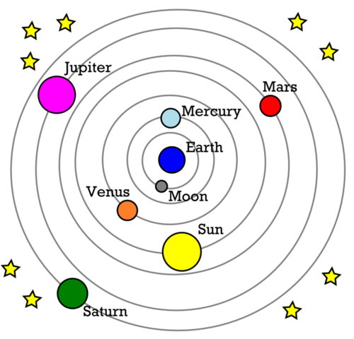
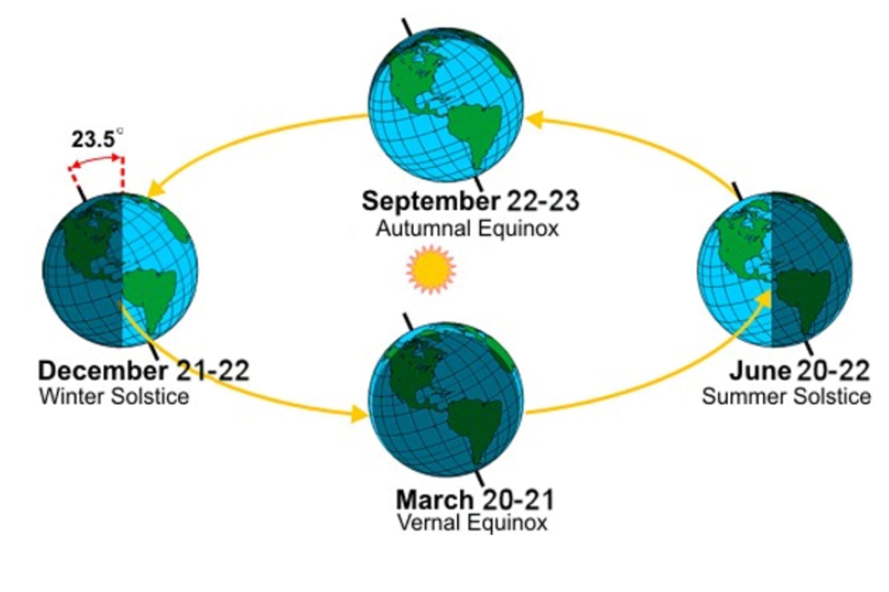
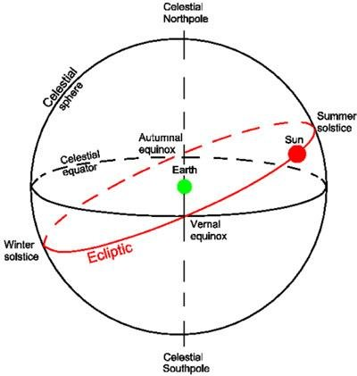
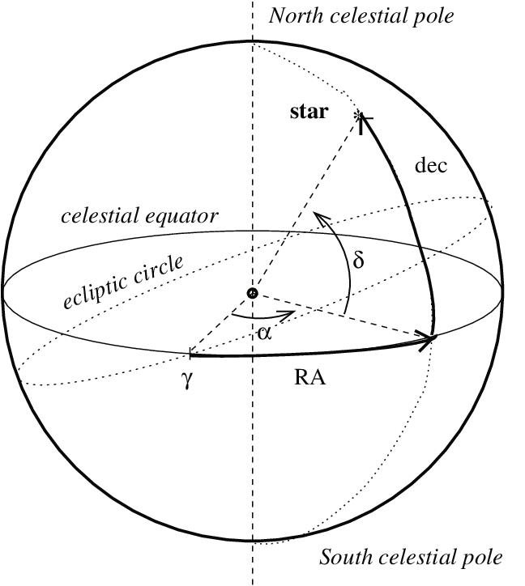
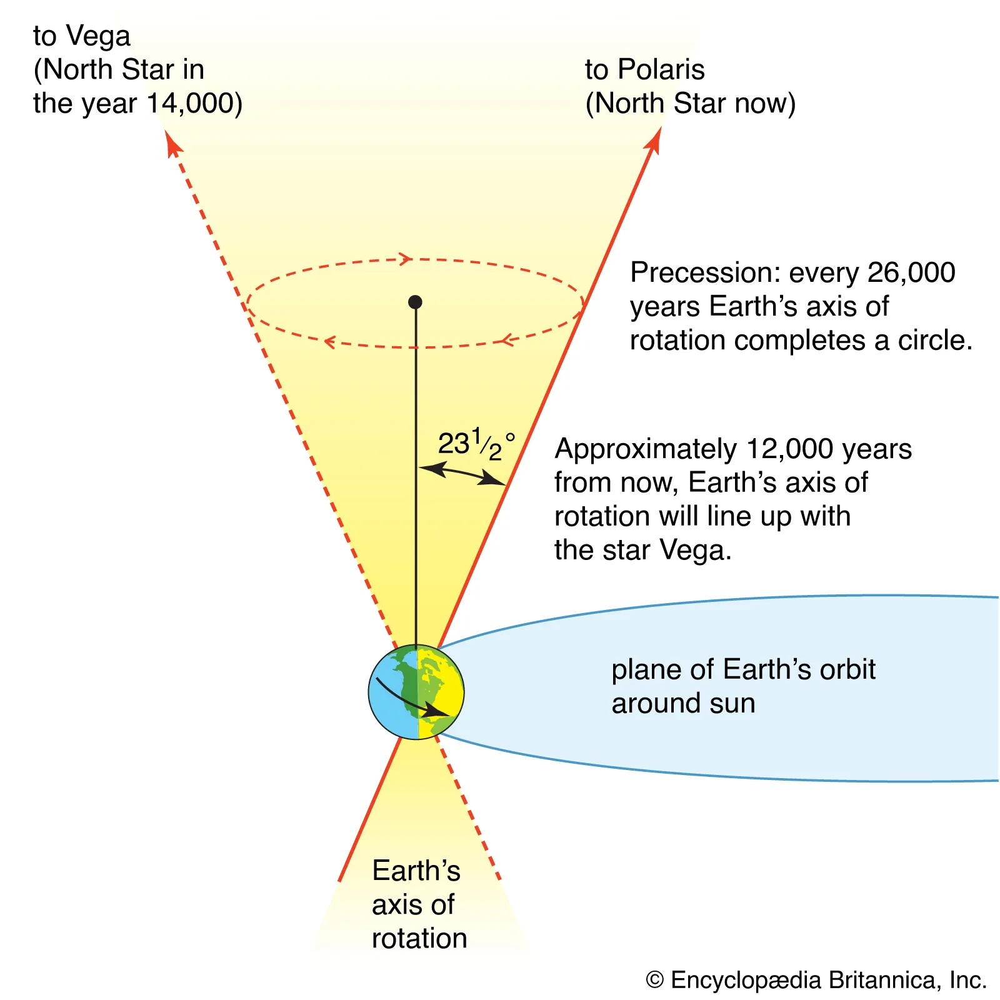

# Intro to Modern Astrophysics

## 1. The Celestial Sphere

#### 1.1 The Geocentric Universe

***Plato (350 BC)***
    
    Geocentric Universe - During this time, it was believed that stars revolved around a fixed Earth. Plato proposed 
    that celestial bodies should move about earth with a constant speed and follow a circular motion with earth at 
    the center of that motion. 

<figure>
    
    <figcaption>Geocentric Model (350 BC)</figcaption>
</figure>

<figure>
    
</figure>

#### 1.2 Retrograde Motion

***Retrograde motion*** - apparent motion of a planet in a direction opposite to that of other bodies within its system, as observed from a particular vantage point.
*Ex. Mars normally moves from west to east, but for a time it undergoes retrograde motion where it moves from east to west*

- This occurs when earth passes mars in it's orbit

#### 1.3 The Copernican Revolution

First to propose a ***heliocentric*** (sun centered) model of planetary motion. 

- Mercury and Venus are never seen more than 28degrees and 47degrees, these are referred to as **inferior planets** and their maximum angular separations east or west of the sun are known as **greatest eastern elongation** and **greatest western elongation**. 

- Mars, Jupiter, and Saturn can be seen as much as 180degrees from the sun, known as **opposition**. This could only occur if these **superior planets** have orbits outside earth's orbit. 

#### 1.4 Positions on the Celestial Sphere

###### Altitude-Azimuth Coordinate System

- During the Summer,  the northern declination causes the sun to appear higher in the sky, producing longer days and more intense sunlight
- During winter, the sun is below the celstial equator so days are shorter and its rays are less intense. 

- This is a geocentric model. From our perspective on earth it can seem like the sun is revolving around the earth. This undo's the 23.5degree tilt of earth therefor giving a tilt to the sun's orbit. The summer soltice is where the sun is at the highest point, and winter solstice is the sun at the lowest point. 
- Celestial equator: passing a plane through earth at its equator and extending it out to the celestial sphere. 

###### Equatorial Coordinate System

**Declination (𝛿)**: equivalent of latitude (N/S) along celestial equator
**Right Ascention**: equivalent of longitude (E/W) along celestial equator

**Q. Find the declinaton for vernal/autumnal equinox and summer/winter solstice**
Vernal/Autumnal equinox: 𝛿 = 0 since this is where the sun crosses the celestial equator
Summer solstice: 𝛿 = 20 since it is above the celestial equator
Winter solstice: 𝛿 = -20 since it is below the celstial equator

**Q. Find the Right Ascension for the above as well**
Vernal: RA = 0
Summer: RA = 6
Autumnal: RA = 12
Winter: RA = 18
*Note: RA is on a scale from 0-24 where they correspond to degrees*
    
    - Measured in H,M,S. 24 hours = 360degrees, 1hr = 15deg

###### Precession
**Precession**: Causes the RA and declination to shift. It is the slow wobble of earths rotation 

- Due to precession, it is necessary to use a specific **epoch** (reference date) when using RA and declination. They can be calculated based on the amount of time elapsed since the reference epoch. 
- The epoch commonly used today refers to an object's position at noon in Greenwich, England (**universal time, UT**) on January 1st, 2000.
- J2000.0

T = (t - 2000.0) / 100
t = current date

M = 1&deg;.2812323T + 0&deg;.0003879T2 + 0&deg;.0000101T3
N = 0&deg;.5567530T + 0&deg;.0001185T2 + 0&deg;.0000116T3

&#9651;&alpha; = M + N sin &alpha; tan &delta;
&#9651;&delta; = N cos &alpha;

**Q. Find Altair's precessed coordinates given &alpha; = 19h50m47.0s and &delta; = +08&deg;52'06.0'' for July 30, 2005**

t = 2005.575
T = .05575
M = .071430&deg;
N = .031039&deg;

19h50m47.0s -> Decimal
19x15 = 285
50x15 = (750/60) = 12.5
47x15 = (705/3600) = .19583
 = **297.696&deg;**

 +08&deg;52'06.0'' -> Decimal
8 + 52/60 + 6/3600
= **8&deg;.868333**

Decimal to DMS
int(.014426) = 0
int((.014426) - 0) * 60 = 0
(.014426 - 0 - 0/60) x 3600 = **51.93''**

**Updated Coordinates are 
RA = 19h51m3.1s
Declination = +08&deg;52'57.9''**
